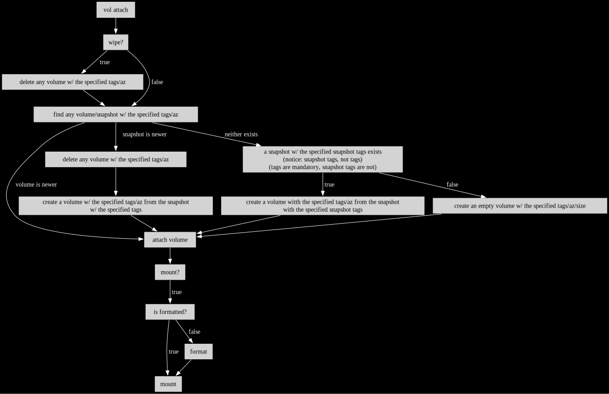

# Tag-based EBS volume management

## What is this?

`vol` is a tool to manage EBS volumes and snapshots using only tags. It can be
invoked from the node that would use the volume (which enables format/(u)mount
features), or any other node.

User actions take a set of tags that should uniquely identify a volume and/or
snapshot.

For instance `vol attach` will locate, or create (and tag) a volume, attach it
to an instance and optionally format and/or mount it. The newer between any
existing volume and snapshot with the specified set of tags would be used. If
neither exists, a snapshot with the specified snapshot tags would be used,
otherwise an empty volume with the specified size. See the visualization
[below](#vol-attach).

Snapshots can be created via `vol snapshot` to be used as starting points, or
to replicate volumes across availability zones.

See the generated help sections below for more information, including examples.

## What practical applications does this have?

While `vol` is general purpose, it was developed for use in CI.

Some observations that lead to the development of this tool:
* CI builds should ideally be as incremental, as possible
* Managing nodes with persistent storage is more problematic than managing
  persistent storage
* Keeping stopped nodes costs more than keeping detached volumes
* Tying nodes and storage together prevents node replacement/upgrade without
  losing incrementality
* Ephemeral nodes are good for consistency and security and are also the
  easiest to manage
* Snapshots can make PR builds incremental on first build (a PR targeting
  a release branch can start with a cloned workspace for that release branch)

Note: in CI, it is recommended to use `--volume-initialization-rate 300` for
best performance and consistency (additional costs apply).

## Goals and scope

* Generic/flexible
  * Covers all CI use-cases
* Usable without additional scripting
  * Don't require storing responses and using them in subsequent calls
  * Infer default values, require as few explicit inputs as possible
  * Require inputs that are easy to provide without extra coding
* Usable on, or off the node
  * Default to on
* Easy to deploy (one file + python/boto3)
* Runs unprivileged (sudo to format/(u)mount)
* Under 1k lines
* Only Linux support

## Usage

```console
% vol -h
usage: vol [-h] {list,attach,detach,snapshot,clean} ...

Tag-based EBS volume management

The script can be invoked on the node, or off (except (u)mount/format)

Reserved tags starting with `vol.' are added to volumes and
snapshots, used in queries and are filtered out before display

The script enforces the requirement that a search by tags must return
at most one result for snapshots and per-availability-zone for volumes
(except clean/list)

options:
  -h, --help            show this help message and exit

action:
  vol <action> -h for more help

  {list,attach,detach,snapshot,clean}
    list                list
    attach              delete/create/attach/mount
    detach              umount/detach/delete
    snapshot            create/overwrite
    clean               delete
%
```

### vol list

```console
% vol list -h
usage: vol list [-h] [-t TAGS] [-T SNAPSHOT_TAGS] [-z AVAILABILITY_ZONE]

* list volumes matching the specified tags (and optionally availability zone)
* list snapshots matching the specified snapshot tags

E.g.:

vol list --tags type=bb.pr.workspace,pr=123

vol list --tags '*' --snapshot-tags '*'

options:
  -h, --help            show this help message and exit
  -t, --tags TAGS       match volume tags: t1=v1,...,tN=vN (default: None)
  -T, --snapshot-tags SNAPSHOT_TAGS
                        match snapshot tags: t1=v1,...,tN=vN (default: None)
  -z, --availability-zone AVAILABILITY_ZONE
                        availability zone for volumes, any if not set (default: None)
%
```

### vol attach

<details>
<summary>visualization</summary>



</details>

```console
% vol attach -h
usage: vol attach [-h] [-f FSTYPE] [-i INSTANCE_ID] [-k KMS_KEY_ID] [-m MOUNTPOINT] [-n NO_SNAPSHOTS]
                  [-r VOLUME_INITIALIZATION_RATE] -s SIZE -t TAGS [-T SNAPSHOT_TAGS] [-w WIPE]
                  [-z AVAILABILITY_ZONE]

* if wipe is specified, delete the volume with the specified tags in the specified availability zone
* find any volume with the specified tags and availability zone and any snapshots with the specified tags
  * if the volume is newer
    * attach it
  * if the snapshot with the specified tags is newer (1)
    * delete any existing volume with the specified tags and availability zone
    * create a volume with the specified tags and availability zone from that snapshot
    * attach it
  * if neither exists
    * if a snapshot with the specified snapshot tags exists
      * create a volume with the specified tags and availability zone from that snapshot
      * attach it
    * otherwise
      * create an empty volume with the specified size, tags and availability zone
      * attach it
* optionally mount, if running on the instance
  * if the volume is not formatted, format it

(1) if you want to attach cross-az, create snapshots, or you'll keep starting with an empty volume

E.g.:

vol attach \
    --tags type=bb.pr.workspace,pr=123,platform=linux,arch=x64 \
    --snapshot-tags type=bb.public.workspace,branch=master,platform=linux,arch=x64 \
    --size 256 \
    --mountpoint /mnt/point

options:
  -h, --help            show this help message and exit
  -f, --fstype FSTYPE   fs type to use with --mountpoint if the volume is not formatted (default: ext4)
  -i, --instance-id INSTANCE_ID
                        instance id, current instance by default (default: None)
  -k, --kms-key-id KMS_KEY_ID
                        KMS key to use for volume encryption, otherwise default (default: None)
  -m, --mountpoint MOUNTPOINT
                        mountpoint, only on <instance-id>, requires util-linux, create if doesn't exist
                        (default: None)
  -n, --no-snapshots NO_SNAPSHOTS
                        do not use snapshots to create volumes (default: False)
  -r, --volume-initialization-rate VOLUME_INITIALIZATION_RATE
                        volume initialization rate in MiB/s (default: None)
  -s, --size SIZE       volume size in GB, if it needs to be created
  -t, --tags TAGS       match volume tags: t1=v1,...,tN=vN
  -T, --snapshot-tags SNAPSHOT_TAGS
                        match snapshot tags: t1=v1,...,tN=vN (default: None)
  -w, --wipe WIPE       delete the matching volume first (default: False)
  -z, --availability-zone AVAILABILITY_ZONE
                        availability zone, derived from instance-id if not set (default: None)
%
```

### vol detach

```console
% vol detach -h
usage: vol detach [-h] [-i INSTANCE_ID] [-m MOUNTPOINT] [-t TAGS] [-w WIPE] [-z AVAILABILITY_ZONE]

* optionally umount, if running on the instance
* detach the volume
* if wipe is specified, delete the volume

E.g.:

vol detach \
    --tags type=bb.pr.workspace,pr=123,platform=linux,arch=x64 \
    --mountpoint /mnt/point

options:
  -h, --help            show this help message and exit
  -i, --instance-id INSTANCE_ID
                        instance id, current instance by default, used to derive az if not set (default:
                        None)
  -m, --mountpoint MOUNTPOINT
                        mountpoint, only on <instance-id>, requires util-linux (default: None)
  -t, --tags TAGS       match volume tags: t1=v1,...,tN=vN (default: [])
  -w, --wipe WIPE       delete the matching volume (default: False)
  -z, --availability-zone AVAILABILITY_ZONE
                        availability zone, required, derived from instance-id if not set (default: None)
%
```

### vol snapshot

```console
% vol snapshot -h
usage: vol snapshot [-h] [-i INSTANCE_ID] [-n NO_CLOBBER] [-t TAGS] -T SNAPSHOT_TAGS [-z AVAILABILITY_ZONE]

* create a snapshot of a volume
* if the snapshot with the specified tags exists, overwrite, unless --no-clobber is used

E.g.:

vol snapshot \
    --tags          type=bb.public.workspace,branch=master,platform=linux,arch=x64 \
    --snapshot-tags type=bb.public.workspace,branch=master,platform=linux,arch=x64

options:
  -h, --help            show this help message and exit
  -i, --instance-id INSTANCE_ID
                        instance id, current instance by default, used to derive az if not set (default:
                        None)
  -n, --no-clobber NO_CLOBBER
                        do not overwrite existing snapshots (default: False)
  -t, --tags TAGS       match volume tags: t1=v1,...,tN=vN (default: [])
  -T, --snapshot-tags SNAPSHOT_TAGS
                        match snapshot tags: t1=v1,...,tN=vN
  -z, --availability-zone AVAILABILITY_ZONE
                        availability zone, required, derived from instance-id if not set (default: None)
%
```

### vol clean

```console
% vol clean -h
usage: vol clean [-h] [-i INTERACTIVE] [-t TAGS] [-T SNAPSHOT_TAGS] [-z AVAILABILITY_ZONE]

* delete volumes matching the specified tags (and optionally availability zone)
* delete snapshots matching the specified snapshot tags

E.g.:

vol clean --tags type=bb.pr.workspace,pr=123,platform=linux,arch=x64

options:
  -h, --help            show this help message and exit
  -i, --interactive INTERACTIVE
                        interactively ask for input (default: False)
  -t, --tags TAGS       match volume tags: t1=v1,...,tN=vN (default: None)
  -T, --snapshot-tags SNAPSHOT_TAGS
                        match snapshot tags: t1=v1,...,tN=vN (default: None)
  -z, --availability-zone AVAILABILITY_ZONE
                        availability zone for volumes, any if not set (default: None)
%
```

## Disclaimer

When the `--mountpoint` option is used, volumes determined to be unformatted
are formatted with no additional confirmation. There is a risk of data loss if
that detection is (or ever becomes) inaccurate.

## Permissions

```terraform
data "aws_iam_policy_document" "vol" {
  statement {
    actions = [
      "ec2:DescribeAvailabilityZones",
      "ec2:DescribeInstances",
      "ec2:DescribeSnapshots",
      "ec2:DescribeTags",
      "ec2:DescribeVolumes",
    ]

    resources = ["*"]
  }

  statement {
    actions = [
      "ec2:AttachVolume",
      "ec2:DetachVolume",
    ]

    resources = ["arn:aws:ec2:${local.region}:${local.account_id}:instance/*"]
  }

  statement {
    actions = [
      "ec2:AttachVolume",
      "ec2:DeleteSnapshot",
      "ec2:DeleteTags",
      "ec2:DeleteVolume",
      "ec2:DetachVolume",
    ]

    resources = [
      "arn:aws:ec2:${local.region}::snapshot/*",
      "arn:aws:ec2:${local.region}:${local.account_id}:volume/*"
    ]

    condition {
      test     = "Null"
      variable = "ec2:ResourceTag/vol.namespace"
      values   = ["false"]
    }
  }

  statement {
    actions = ["ec2:CreateTags"]

    resources = [
      "arn:aws:ec2:${local.region}::snapshot/*",
      "arn:aws:ec2:${local.region}:${local.account_id}:volume/*",
    ]

    condition {
      test     = "Null"
      variable = "aws:RequestTag/vol.namespace"
      values   = ["false"]
    }
  }

  statement {
    actions = ["ec2:CreateTags"]

    resources = [
      "arn:aws:ec2:${local.region}::snapshot/*",
      "arn:aws:ec2:${local.region}:${local.account_id}:volume/*",
    ]

    condition {
      test     = "Null"
      variable = "ec2:ResourceTag/vol.namespace"
      values   = ["false"]
    }
  }

  statement {
    actions = ["ec2:CreateVolume"]

    resources = ["arn:aws:ec2:${local.region}:${local.account_id}:volume/*"]

    condition {
      test     = "Null"
      variable = "aws:RequestTag/vol.namespace"
      values   = ["false"]
    }
  }

  statement {
    actions = ["ec2:CreateVolume"]

    resources = ["arn:aws:ec2:${local.region}::snapshot/*"]

    condition {
      test     = "Null"
      variable = "ec2:ResourceTag/vol.namespace"
      values   = ["false"]
    }
  }

  statement {
    actions = ["ec2:CreateSnapshot"]

    resources = ["arn:aws:ec2:${local.region}::snapshot/*"]

    condition {
      test     = "Null"
      variable = "aws:RequestTag/vol.namespace"
      values   = ["false"]
    }
  }

  statement {
    actions = ["ec2:CreateSnapshot"]

    resources = ["arn:aws:ec2:${local.region}:${local.account_id}:volume/*"]

    condition {
      test     = "Null"
      variable = "ec2:ResourceTag/vol.namespace"
      values   = ["false"]
    }
  }

  statement {
    actions = [
      "kms:CreateGrant",
      "kms:Decrypt",
      "kms:DescribeKey",
      "kms:GenerateDataKeyWithoutPlainText",
      "kms:ReEncrypt",
    ]

    resources = [
      "arn:aws:kms:${local.region}:${local.account_id}:alias/aws/ebs",
    ]
  }
}
```
